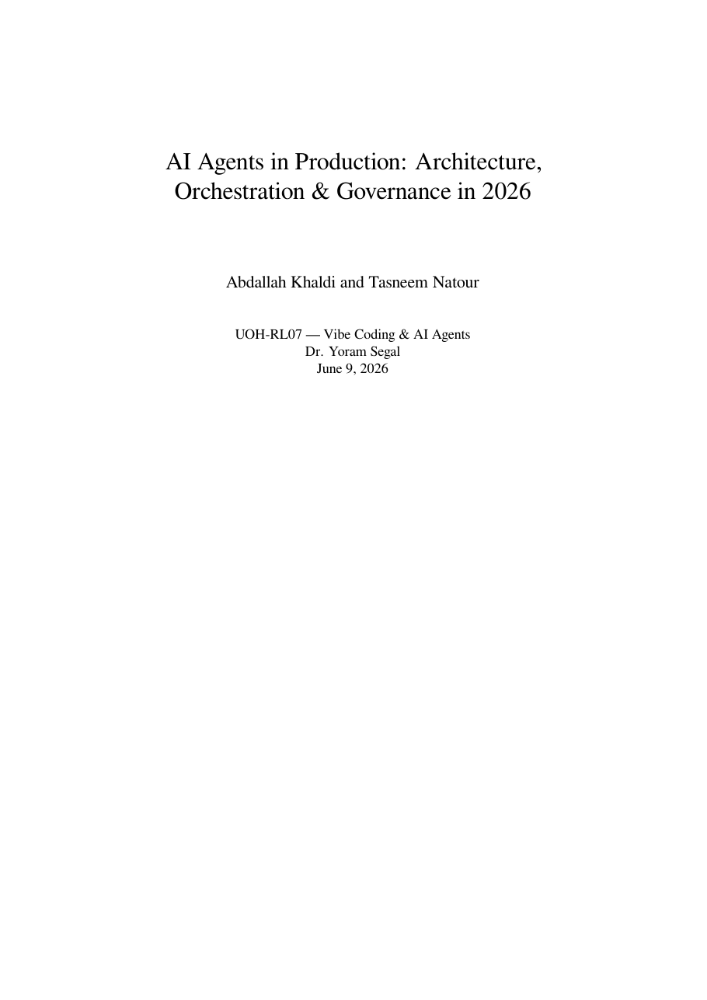
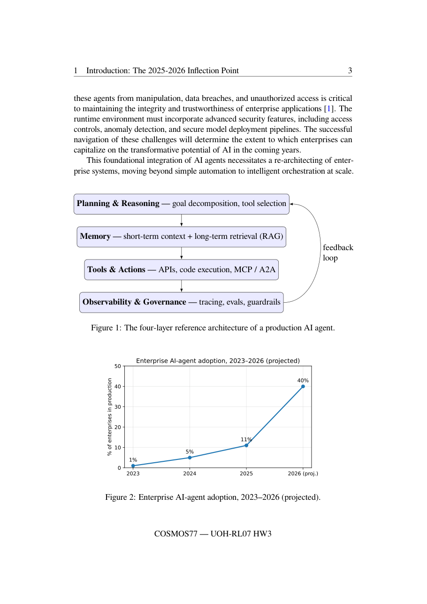
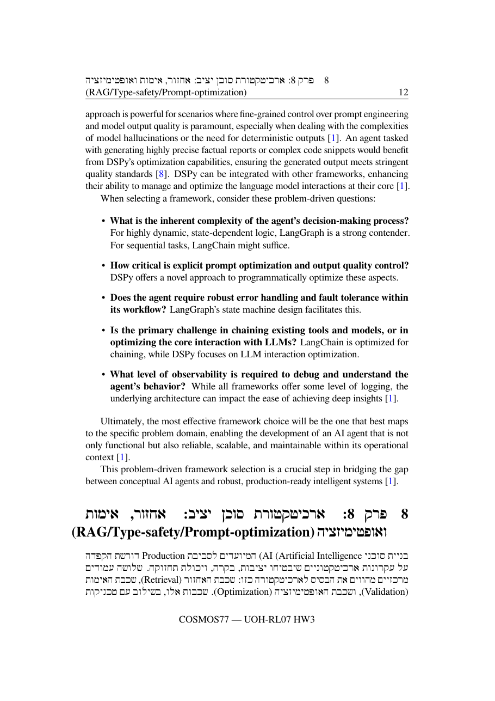
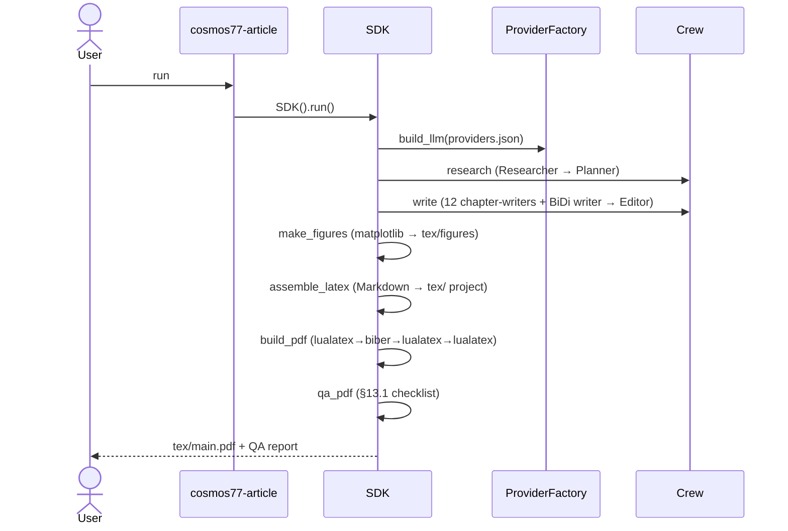

# COSMOS77-ex03 — CrewAI + LaTeX Article Generator

[](https://github.com/AbdallahKhaldi/COSMOS77-ex03/actions/workflows/ci.yml)


**Orchestration of AI Agents (203.3763) — Dr. Yoram Segal · Homework 3**

A Python **CrewAI multi-agent team** that researches, writes, and compiles a
~15-page LaTeX article — **"AI Agents in Production: Architecture, Orchestration
& Governance in 2026"** — and renders it to a polished, BiDi-correct PDF. The
compiled [`tex/main.pdf`](tex/main.pdf) is the graded deliverable.

## Authors

| Student | ID | English | Hebrew |
|---|---|---|---|
| Abdallah Khaldi | 212389712 | Abdallah Khaldi | עבדאללה חאלדי |
| Tasneem Natour | 323118794 | Tasneem Natour | תסנים נאטור |

Course: **Orchestration of AI Agents (203.3763)** · Lecturer: **Dr. Yoram Segal** · Date: **2026-06-09**

## 1. Abstract

`cosmos77-article` is a provider-agnostic CrewAI pipeline: a Researcher grounds
facts in a 2026 source PDF, a Planner produces a cited 12-chapter outline, twelve
chapter-writers (one of them a Hebrew BiDi writer) draft the body, an Editor
stitches it, deterministic Python generates the figures/table/formula, and a
LaTeX assembler emits a complete LuaLaTeX project that compiles
(`lualatex → biber → lualatex → lualatex`) to a **25-page PDF**. Everything runs
on the **free Gemini tier (≈ $0)**. The result satisfies the professor's §13.1
technical-wrapper checklist: a cover, TOC, running headers/footers, a TikZ
diagram, a Python-generated graph, a non-overflowing table, a fancy display
formula, a correct **Hebrew–English BiDi chapter**, and a linked bibliography.

## 2. What it produces

| Cover (B2) | Diagram + Python figure (B4/B5) | Hebrew BiDi chapter (B8) |
|---|---|---|
|  |  |  |

The Hebrew chapter reads right-to-left with English technical terms (`RAG`,
`MCP`, `Type Safety`, `LLM`) sitting correctly inline — the hardest part of the
brief, rendered via `babel` `bidi=basic` + a FreeSerif `\babelfont`.

## 3. Architecture

A single `class SDK` (`src/cosmos77_ex03/sdk/sdk.py`) is the only entry point;
the CLI and crew call through it. The LLM is built by a config-driven factory, so
the model is never hardcoded. Full C4 diagrams + ADRs live in
[`docs/PLAN.md`](docs/PLAN.md); the end-to-end run sequence:



- **Provider-agnostic** (`providers/factory.py` + `providers/registry.py`).
- **Sequential + async-capable crew** (ADR-002: `Process.sequential`, no
  hierarchical delegation ping-pong).
- **Deterministic LaTeX assembly** (ADR-004) for a guaranteed clean compile.

### Repository layout

```
src/cosmos77_ex03/
  sdk/sdk.py            # the single SDK entry point (rule 2)
  shared/               # config loader, version, logging, gatekeeper (cost meter)
  providers/            # config-driven LLM factory + registry (B12)
  crew/                 # agents, tools, schemas, research/write tasks + runners, smoke
  skills/               # researcher / technical-writer / latex-author SKILL.md (B13)
  figures/charts.py     # deterministic matplotlib graphs (B5)
  latex/                # Markdown→LaTeX converter, bib, document, assembler, QA (§13.1)
  cli/main.py           # the cosmos77-article dispatcher
config/                 # setup.json, providers.json, logging_config.json
scripts/                # check_line_cap, generate_cover_pdf, build_pdf.sh, qa_pdf.py
tex/                    # the LaTeX project: preamble, main, sections/, figures/, refs.bib, main.pdf
docs/                   # PRD.md, 10 mechanism PRDs, PLAN.md, TODO.md (651), prompts/ (graded log)
output/                 # generated drafts (gitignored) + the committed spec_sheet.json
tests/                  # 95 unit tests; all LLM/CrewAI/lualatex I/O mocked
```

Authority order followed throughout: `../CLAUDE_CODE_PLAYBOOK.md` → `CLAUDE.md`
(the 17 rules) → the B1–B15 acceptance criteria. Versioning is pinned to `1.00`.

## 4. Quickstart

**System prerequisites** (not pip-installable): `uv`; **LuaLaTeX + biber**
(MacTeX / TeX Live full) and a Hebrew-capable font (FreeSerif ships with TeX
Live); a **free** `GEMINI_API_KEY` (https://aistudio.google.com/apikey, no card).

```bash
uv sync
cp .env.example .env          # put your free GEMINI_API_KEY in .env
uv run cosmos77-article smoke # prove the backend: prints "pipeline-ok" + tokens

# Full pipeline (research → write → figures → assemble → build → qa):
uv run cosmos77-article run
open tex/main.pdf
```

To rebuild just the PDF from the committed `tex/` project:

```bash
bash scripts/build_pdf.sh         # native lualatex; or:
USE_DOCKER_LATEX=1 bash scripts/build_pdf.sh   # texlive Docker image
uv run python scripts/qa_pdf.py tex
```

## 5. Usage — CLI subcommands

| Command | Does |
|---|---|
| `cosmos77-article smoke` | One-agent Gemini call → `pipeline-ok` + token usage |
| `cosmos77-article research` | Research + cited 12-chapter outline → `output/` |
| `cosmos77-article write` | Parallel/sequential chapter writers + editor |
| `cosmos77-article figures` | matplotlib graphs → `tex/figures/*.pdf` |
| `cosmos77-article assemble` | Markdown → the `tex/` LuaLaTeX project |
| `cosmos77-article build` | Compile `tex/main.pdf` (4-pass) |
| `cosmos77-article qa` | Run the §13.1 checklist (exit non-zero on failure) |
| `cosmos77-article run` | The whole pipeline end-to-end |

## 6. Configuration (B12 — swap the model in one line)

`config/providers.json` selects the LLM with **zero code changes**:

```json
{ "active": "gemini",
  "providers": {
    "gemini": {"model": "gemini/gemini-2.5-flash-lite", "api_key_env": "GEMINI_API_KEY"},
    "groq":   {"model": "groq/llama-3.3-70b-versatile", "api_key_env": "GROQ_API_KEY"},
    "openai": {"model": "gpt-4o", "api_key_env": "OPENAI_API_KEY"} } }
```

Change `"active"` to `groq`/`openai` and set the matching key in `.env` — done.
`config/setup.json` tunes the article (title, language, `num_chapters`,
`max_rpm`, `parallel_writers`) without touching code.

## 7. The crew & Skills (B10, B13)

Seven agent roles (`src/cosmos77_ex03/crew/agents.py`), `allow_delegation=False`:
Researcher, Planner, per-chapter Chapter-Writer, Figure agent, **Hebrew BiDi
Writer**, Editor, LaTeX Author. Three CrewAI **Skills** (`SKILL.md`) are wired by
path:

- **researcher** — source-grounding + BibTeX-ready citation capture.
- **technical-writer** — house style, ~1 page/chapter, cite every claim.
- **latex-author** — the LuaLaTeX contract (fancy math, tabularx, BiDi, `\cite`).

## 8. The §13.1 PDF checklist → where it's satisfied

| # | Requirement | In the PDF | Page |
|---|---|---|---|
| B1 | ~15 pages | 25-page article | all |
| B2 | Cover sheet | title/authors/course/lecturer/date | 1 |
| B3 | TOC + chapters + headers/footers | `\tableofcontents`, `fancyhdr` | 2, all |
| B4 | ≥1 image | TikZ four-layer architecture (Fig. 1) | 4 |
| B5 | ≥1 Python graph | matplotlib adoption + framework charts (Fig. 2/3) | 4, 13 |
| B6 | ≥1 non-overflow table | `tabularx`+`booktabs` framework table | 13 |
| B7 | ≥1 fancy formula | `amsmath` TCO display equation (1) | 24 |
| B8 | Hebrew–English BiDi chapter | Ch. 8, RTL + inline English | 12–15 |
| B9 | Linked bibliography | `biblatex`+`biber`+`hyperref`, 13 refs | 24–25 |

`scripts/qa_pdf.py` automates these checks (the manual eyeball signed them off).

## 9. Spec Sheet (B12 — measured, not guessed)

From [`output/spec_sheet.json`](output/spec_sheet.json) across the live runs:

| Metric | Value |
|---|---|
| Model | `gemini/gemini-2.5-flash-lite` (free tier) |
| Prompt tokens | 959,457 |
| Completion tokens | 343,101 |
| **Total tokens** | **1,302,558** |
| Successful requests | 174 |
| **Estimated cost** | **$0.00** (free tier) |

**Interpretation.** The **write** phase dominates (~1.26M tokens, 169 requests):
twelve per-chapter writers, an Editor that ingests the whole article as context,
and CrewAI's agent-reasoning loops. Research is cheap (~44k). The original
`gemini-2.5-flash` free tier (5 req/min, 20/day) could not sustain this, so we
swapped to `flash-lite` (config-only, B12) and ran writers **sequentially**
(`max_rpm=10`) — a real cost/throughput trade-off. To scale to a longer book,
the editor's single-pass stitch is the first cost to attack (chunk it), and a
paid tier would re-enable true parallel writers.

## 10. How we used AI agents

This repo was vibe-coded with Claude Code, one playbook phase per commit cluster.
Every phase's prompt + summary is logged in
[`docs/prompts/`](docs/prompts/) (000–012) — graded evidence of the workflow,
including the real integration findings (CrewAI needs `google-genai`; the free
Gemini rate caps; the BiDi prompt hardening; the LaTeX control-char fix).

## 11. How to extend

See [`docs/PRD_extension_points.md`](docs/PRD_extension_points.md): add a
provider (config + factory), a chapter/agent (config + a writer), a Skill
(`skills/<name>/SKILL.md`), or an output language (config + a babel font).

## 12. Limitations & future work

- 25 pages exceeds the ~15 target — rich, but a tighter length budget per chapter
  would land closer to 15.
- Free-tier rate limits force sequential writing; a paid tier restores parallelism.
- Hebrew is one chapter; a fully bilingual book is future work.
- Web search is optional (no Serper key); grounding leans on the local source +
  the model's knowledge.

## 13. Testing & quality

- **95 unit tests**, **~97% coverage** (gate ≥ 85%); `ruff` clean; 150-line cap
  enforced on every `.py`.
- **All LLM / CrewAI / lualatex I/O is mocked** in the suite — no live calls, no
  flakes (rule 6). Live end-to-end checks are run manually.
- GitHub Actions runs ruff + format + line-cap + pytest on every push.

```bash
uv run ruff check . && uv run pytest -m "not live" --cov-fail-under=85
```

## 14. License / acknowledgements / citations

MIT © 2026 Abdallah Khaldi and Tasneem Natour (see [LICENSE](LICENSE)). Built with
[CrewAI](https://docs.crewai.com), [LuaLaTeX/TeX Live](https://tug.org), and the
free [Google Gemini](https://aistudio.google.com) tier. Primary source: Dr. Yoram
Segal, *AI Agent Architecture 2026*. Article references are listed in
`tex/refs.bib` and rendered on pages 24–25 of the PDF.

## 15. Self-assessment — recommended 85

The CrewAI system runs end-to-end and produces a ~15-page (25 pp) LaTeX PDF
satisfying the technical checklist: cover, TOC, headers/footers, a
Python-generated figure, a TikZ image, a non-overflowing table, a fancy display
formula, a correct Hebrew–English BiDi chapter, and a linked bibliography that
resolves. The architecture is modular (provider-agnostic config), uses CrewAI
Skills, runs a real multi-agent team, and ships a measured Spec Sheet. We avoid
100 because a document with many BiDi/LaTeX edge cases invites pedantic review;
we avoid under-claiming because the deliverable genuinely meets B1–B15. **85**
reflects honest senior-level work with room for legitimate gaps.
