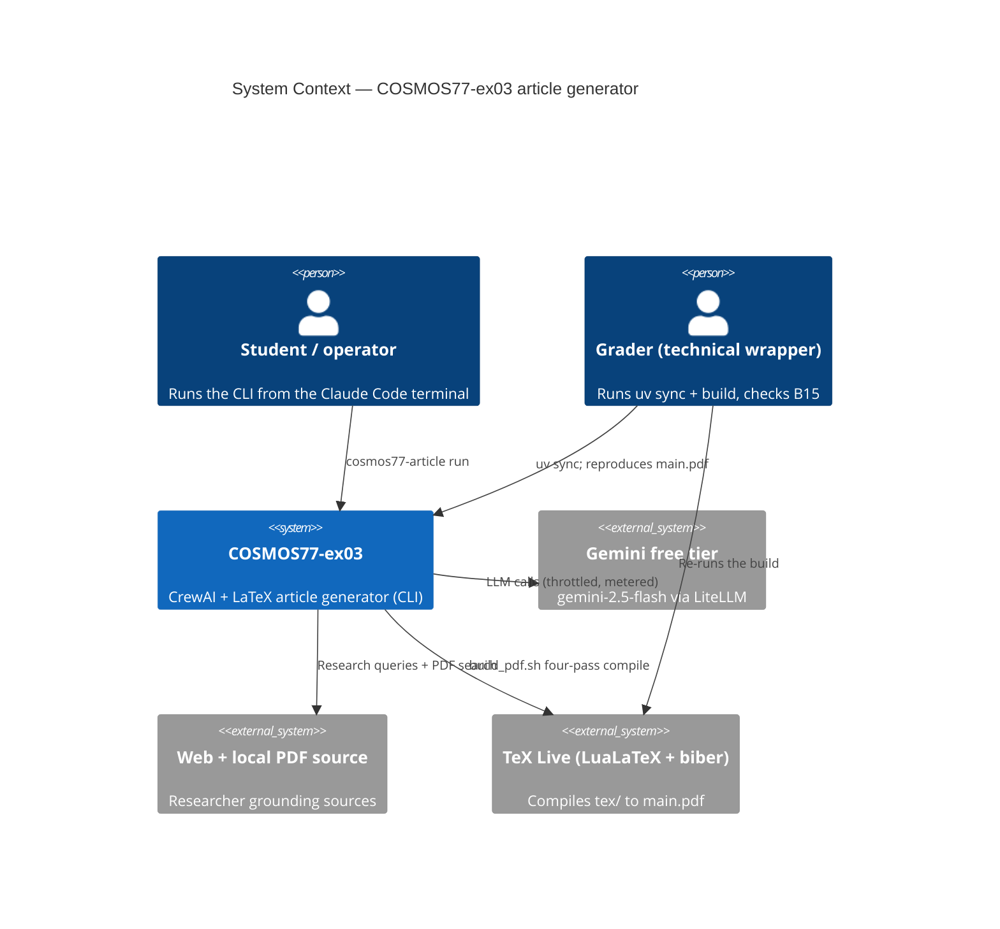
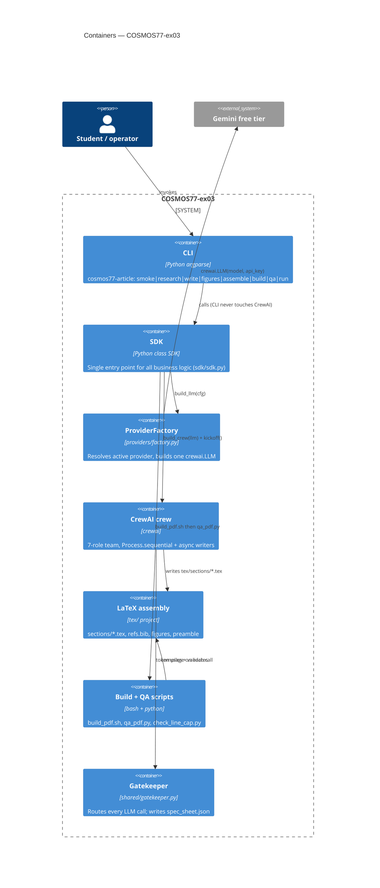
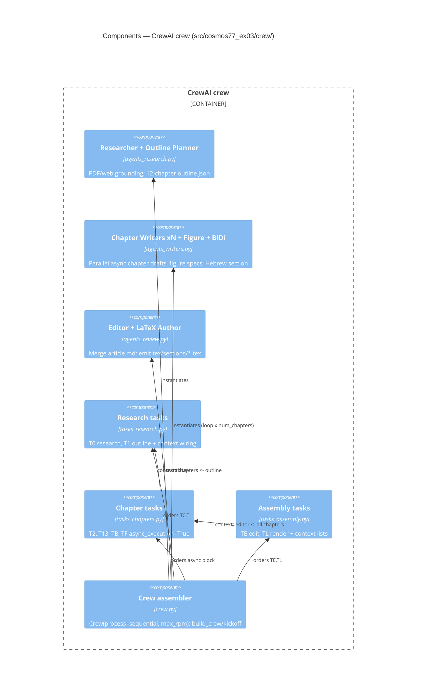
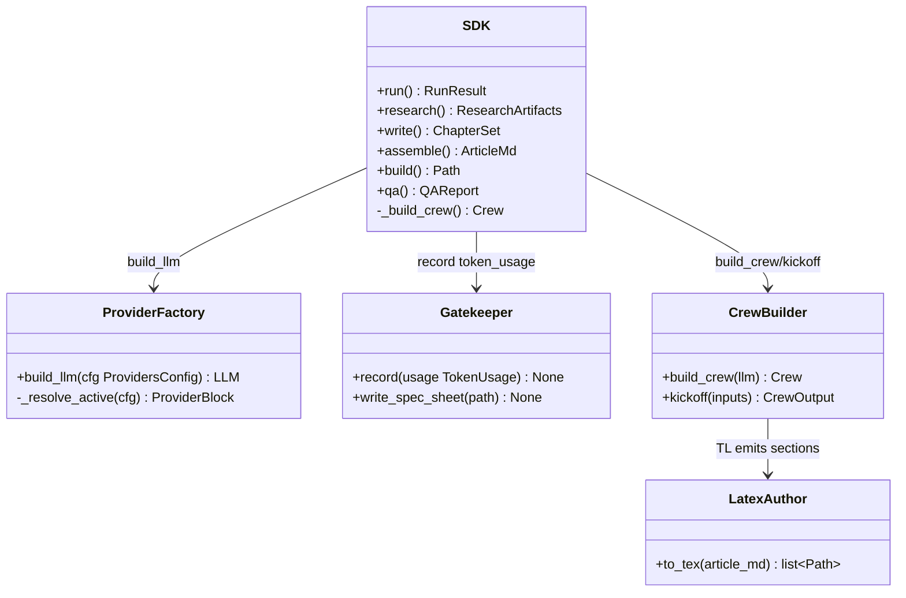

# PLAN — COSMOS77-ex03 Architecture & Build

This plan is the architecture-of-record for the HW3 deliverable: a CrewAI
multi-agent program that researches, plans, writes, illustrates, edits, and
renders a 15-page LaTeX article (`tex/main.pdf`) for 203.3763. It is binding
alongside `CLAUDE.md` and the acceptance criteria B1–B15. The pipeline is a
single arc: **CLI → SDK → ProviderFactory → CrewAI crew → LaTeX assembly →
`build_pdf.sh` → `qa_pdf.py` → PDF.** Every section below ties back to that arc.

---

## 1. C4 Model

### 1.1 Level 1 — System Context



### 1.2 Level 2 — Containers



### 1.3 Level 3 — Components (inside the crew container)



### 1.4 Level 4 — Code (the SDK seam)



---

## 2. End-to-End Sequence (one full run)

```mermaid
sequenceDiagram
  actor Op as Operator
  participant CLI as cosmos77-article
  participant SDK as SDK
  participant PF as ProviderFactory
  participant Crew as Crew
  participant R as Researcher
  participant P as Planner
  participant W as Writers (async)
  participant F as Figure agent
  participant E as Editor
  participant L as LaTeX Author
  participant FS as tex/ files
  participant B as build_pdf.sh
  participant Q as qa_pdf.py
  Op->>CLI: cosmos77-article run
  CLI->>SDK: SDK().run()
  SDK->>PF: build_llm(providers.json)
  PF-->>SDK: crewai.LLM (gemini-2.5-flash)
  SDK->>Crew: build_crew(llm); kickoff()
  Crew->>R: T0 research (PDF + web)
  R-->>Crew: research.md + citations.json
  Crew->>P: T1 plan outline
  P-->>Crew: outline.json (12 chapters)
  par parallel fan-out
    Crew->>W: T2..T13 write chapters
    W-->>Crew: ch_NN.md
  and
    Crew->>F: TF figure/table specs
    F-->>Crew: TikZ + matplotlib + table specs
  end
  Crew->>E: TE edit & assemble
  E-->>Crew: article.md
  Crew->>L: TL render LaTeX
  L->>FS: write sections/*.tex + refs.bib
  Crew-->>SDK: CrewOutput (token_usage)
  SDK->>B: scripts/build_pdf.sh
  B->>FS: lualatex; biber; lualatex; lualatex (4-pass)
  B-->>SDK: tex/main.pdf
  SDK->>Q: scripts/qa_pdf.py
  Q-->>SDK: B15 checklist report
  SDK-->>CLI: RunResult (pdf path, QA status)
  CLI-->>Op: exit 0 + summary
```

Note: the parallel block is the async chapter/figure/BiDi stage. The Hebrew BiDi
writer (TB) runs in the same fan-out as the chapter writers and is joined at TE.

---

## 3. Architecture Decision Records

### ADR-001 — Gemini free tier as the LLM provider

- **Context.** We need a capable LLM for a 12-chapter article under zero budget.
  Options: paid APIs (cost), an Anthropic Claude subscription (Anthropic blocks
  third-party agent frameworks from driving a consumer subscription, so CrewAI
  cannot use it), and local Ollama (a laptop cannot serve a 70B-class model at
  usable latency for parallel writers).
- **Decision.** Use the Gemini free tier (`gemini/gemini-2.5-flash`) via
  CrewAI's LiteLLM-backed `LLM`, key from `GEMINI_API_KEY`.
- **Consequences.** Zero cost, real capability, and a clean swap path (groq /
  openai already in `providers.json`). We inherit free-tier rate limits, handled
  by `max_rpm` + retry/backoff (see ADR-002 and the risk register).

### ADR-002 — Process.sequential + async tasks (not hierarchical)

- **Context.** CrewAI offers `Process.hierarchical` (a manager delegates to
  workers) and `Process.sequential` (a fixed task DAG).
- **Decision.** Use `Process.sequential` with `async_execution=True` on the
  chapter/figure/BiDi fan-out tasks; `allow_delegation=False` on all workers.
- **Consequences.** A manager would create a delegation ping-pong (re-ask /
  re-answer / re-evaluate) that is non-deterministic and burns free-tier tokens,
  fighting rule 17. The sequential DAG is deterministic and trivially mockable,
  while the async block still gives genuine writer parallelism, joined at the
  editor via static `context` wiring instead of an LLM manager.

### ADR-003 — LuaLaTeX + babel (bidi=basic), not XeLaTeX/polyglossia

- **Context.** The article needs one Hebrew–English BiDi chapter (B8). The two
  common BiDi stacks are XeLaTeX + polyglossia and LuaLaTeX + babel.
- **Decision.** Compile with LuaLaTeX and use `babel` with `bidi=basic` plus
  `\babelfont` for the Hebrew script.
- **Consequences.** Under LuaTeX, polyglossia emits a "Hebrew is not supported"
  warning and BiDi is unreliable; `babel(bidi=basic)` is the supported,
  warning-free path on LuaLaTeX and also gives us robust Unicode/font handling
  for the rest of the document. The build pins LuaLaTeX everywhere for one
  consistent engine.

### ADR-004 — Markdown-first, then convert to .tex

- **Context.** Agents are far more reliable producing Markdown than raw LaTeX,
  and LaTeX emitted token-by-token is fragile (unbalanced braces, bad escapes).
- **Decision.** Writers, the figure agent, and the editor all work in Markdown
  (`output/chapters/*.md`, `output/article.md`); a dedicated LaTeX Author agent
  (task TL) converts the edited Markdown into `tex/sections/*.tex` and wires
  figures, tables, and the bibliography.
- **Consequences.** A clean seam between content and typesetting: content agents
  stay simple and mockable, LaTeX concerns live in one agent, and the .tex layer
  can be regenerated without re-running the writers.

### ADR-005 — Provider-agnostic config for modularity

- **Context.** Provider choice (ADR-001) must not leak into agent code; rule 4
  forbids hardcoded model/provider strings.
- **Decision.** All provider data lives in `config/providers.json`
  (`active`, per-provider `model` + `api_key_env`). `providers/factory.py`
  resolves the active block and returns one `crewai.LLM`.
- **Consequences.** Swapping gemini → groq/openai is a one-line config edit with
  zero code change. Agents never name a model inline; tests patch `crewai.LLM`
  and assert the exact model string flows from config.

### ADR-006 — Single SDK entry point

- **Context.** Rule 2 mandates that all business logic flow through `class SDK`.
- **Decision.** The CLI is a thin argparse dispatcher; every stage
  (`research`, `write`, `figures`, `assemble`, `build`, `qa`, `run`) calls an
  `SDK` method. Only the SDK constructs the crew, calls the factory, kicks off,
  and invokes `build_pdf.sh` / `qa_pdf.py`. Nothing else imports CrewAI.
- **Consequences.** One testable surface, one place to mock for the whole
  pipeline, and a CLI that cannot drift from the library. Reuse across CLI
  subcommands is free.

### ADR-007 — The 150-line file cap

- **Context.** Rule 1 caps every `.py` file at 150 lines to force decomposition.
- **Decision.** Split the crew across `agents_research.py`, `agents_writers.py`,
  `agents_review.py`, `tasks_research.py`, `tasks_chapters.py`,
  `tasks_assembly.py`, and `crew.py`; shared strings/enums live in
  `constants.py`. `scripts/check_line_cap.py` enforces the cap in pre-commit
  and CI.
- **Consequences.** Small, single-responsibility modules that are easy to test
  and review; the cap is mechanically verified, so a violation fails the build
  rather than slipping through review. Any genuinely impossible case is recorded
  as a new ADR here, never a silent breach.

---

## 4. Risk Register

| # | Risk | Trigger | Mitigation |
|---|------|---------|------------|
| R1 | Free-tier rate limits | 12 async writers spike Gemini RPM; HTTP 429 | `Crew(max_rpm=10)` global ceiling + LiteLLM retry/backoff; `parallel_writers=false` fallback to synchronous, zero code change |
| R2 | BiDi rendering bugs | Hebrew runs reversed, mis-joined, or with stray LTR punctuation | The QA eyeball loop: render, visually inspect the BiDi page, fix `\foreignlanguage{hebrew}{...}` / `\babelfont` until correct; `qa_pdf.py` asserts the Hebrew section exists |
| R3 | Table overflow | A wide booktabs table runs past `\textwidth` (Overfull \hbox) | Use a `tabularx` `X` column so the table flexes to `\textwidth`; QA scans the `.log` for Overfull boxes on table pages |
| R4 | Flat / trivial formulas | Writers emit inline plain-text math instead of real display math (B7) | "Fancy amsmath" instruction in the writer + editor prompts (display environments, aligned, operators) + a QA check that a display-math environment is present |
| R5 | Citations not resolving | `\cite` renders as `[?]`; `.bbl` missing or stale | The four-pass compile (`lualatex → biber → lualatex → lualatex`) so biber resolves refs and the later passes fix cross-references; QA asserts `\cite` keys resolve against a built `.bbl` |
| R6 | Non-deterministic tests | A live LLM/network/subprocess call leaks into the suite | Mock every `Crew.kickoff`, Gemini, web/PDF, and `lualatex` call; seed all randomness (rules 6, 17); coverage gate >= 85% |
| R7 | Secret leakage | `GEMINI_API_KEY` committed | `.env` gitignored, `.env.example` only, pre-commit secret scan |

---

## 5. Build Order (phased)

1. **Phase 0 (done).** Scaffolding: CLI dispatcher, SDK stub, config JSON,
   placeholder `build_pdf.sh` / `qa_pdf.py`, line-cap script, CI.
2. **ProviderFactory.** `providers/factory.py` + tests (ADR-005, B12 seam).
3. **Crew agents + tasks.** The seven roles and the DAG (ADR-002, B10).
4. **Research tool.** PDF/web grounding for the Researcher (mocked in tests).
5. **Figures.** TikZ + matplotlib + tabularx specs, offline render (B4–B6).
6. **BiDi chapter.** Hebrew–English writer + babel wiring (ADR-003, B8).
7. **LaTeX Author.** Markdown → `tex/sections/*.tex` + biblatex (ADR-004, B9, B11).
8. **Gatekeeper / Spec Sheet.** Token accounting into `spec_sheet.json` (B12).
9. **Build + QA.** Real four-pass `build_pdf.sh` and the §13.1 `qa_pdf.py`
   checklist (R3–R5, B15).
10. **End-to-end `run`.** Wire `SDK.run()` across the full arc; tag `v1.00`.

Each phase is TDD red→green→refactor, keeps coverage >= 85%, passes `ruff` and
the line-cap check, and is committed with a Conventional Commit referencing its
TODO IDs. The compiled `tex/main.pdf` passing the §13.1 checklist outranks
everything else.
